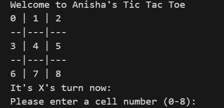

# Python Tic Tac Toe


## Description

This is a simple command-line Tic Tac Toe game implemented in Python. It allows two players to take turns placing their marks (X or O) on a 3x3 grid. The first player to get three of their marks in a row, column, or diagonal wins the game. If all cells are filled and no player has won, the game ends in a tie.

## Installation

1. Clone this repository to your local machine:

    ```bash
    git clone https://github.com/hahaanisha/tic-tac-toe.git
    ```

2. Navigate to the project directory:

    ```bash
    cd tic-tac-toe
    ```

3. Run the game:

    ```bash
    python tic_tac_toe.py
    ```

## Usage

- Upon running the game, you'll see the Tic Tac Toe board displayed in the command line.
- Players will take turns entering the number corresponding to the cell(0-8) where they want to place their mark.
- The game will continue until one player wins or the board is full (resulting in a tie).

## Logic

The game logic is implemented as follows:

- The `printBoard` function displays the current state of the Tic Tac Toe board. At each position it checks if X or O has entered that particular position. If not then the cell number will be printed
- The `check` function checks if there is a winner after each move. It iterates through all winning combinations and checks if any player has three marks in a row, column, or diagonal. If a winner is found, the function returns `True`. If the board is full and no winner is found, it returns `True` to indicate a tie. Otherwise, it returns `False`, indicating that the game should continue.
- The main game loop alternates between the two players, allowing them to make moves until the game ends.

## Output



## Author

- [Anisha Shankar](https://github.com/hahaanisha)
